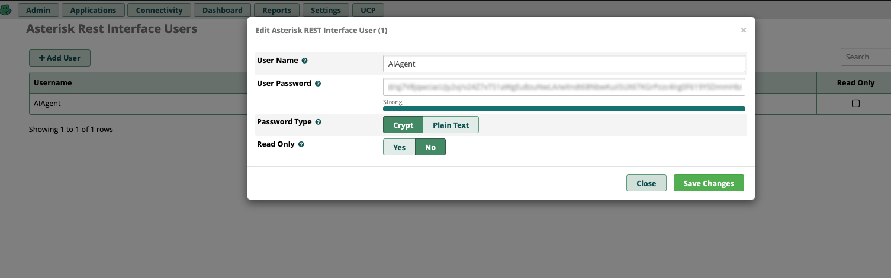
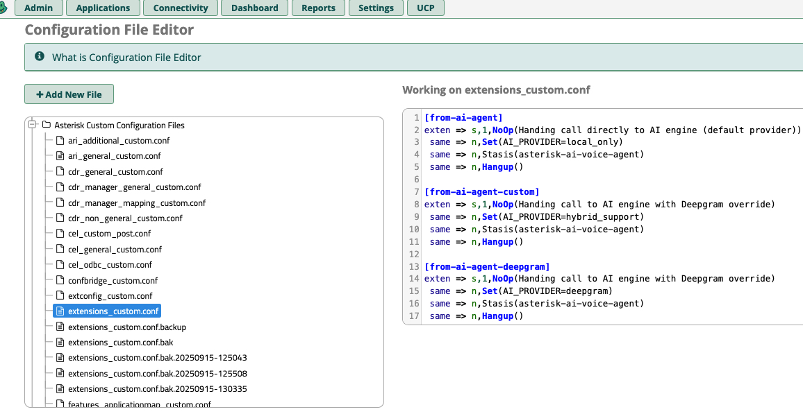
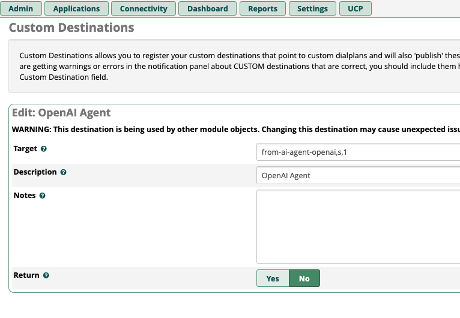

# FreePBX Integration Guide

Complete guide for integrating Asterisk AI Voice Agent v6.0+ with FreePBX.

## 1. Overview

The Asterisk AI Voice Agent integrates with FreePBX using the **Asterisk REST Interface (ARI)**. Calls enter the Stasis application, and the `ai_engine` service handles call control, audio transport, and AI provider orchestration.

If you’re setting this up for the first time, follow the canonical “first successful call” flow first:

- [INSTALLATION.md](INSTALLATION.md)
- [Configuration-Reference.md](Configuration-Reference.md) → "Call Selection & Precedence (Provider / Pipeline / Context)"
- [Transport-Mode-Compatibility.md](Transport-Mode-Compatibility.md)
- [OUTBOUND_CALLING.md](OUTBOUND_CALLING.md) (alpha feature: outbound campaign dialer)

This guide focuses on FreePBX integration mechanics (ARI user, dialplan routing, networking).

Transport selection is configuration-driven (see `Transport-Mode-Compatibility.md` for validated combinations).

## 2. Prerequisites

### 2.1 System Requirements

**For co-located deployment** (recommended for beginners):
- FreePBX installation with Asterisk 18+ (or FreePBX 15+) and ARI enabled
- Docker and Docker Compose installed on the **same host** as FreePBX
- Repository cloned (e.g., `/root/Asterisk-AI-Voice-Agent`)
- Port **8090/TCP** accessible for AudioSocket connections
- Port **18080/UDP** accessible for ExternalMedia RTP (if using RTP transport)
- Valid `.env` containing ARI credentials and provider API keys

**For remote deployment** (Asterisk on different host/container):
- Network connectivity between `ai_engine` and Asterisk hosts:
  - **ARI**: TCP port 8088 (`ai_engine` → Asterisk)
  - **AudioSocket**: TCP port 8090 (Asterisk → `ai_engine`)
  - **ExternalMedia RTP**: UDP port 18080 (Asterisk → `ai_engine`, and `ai_engine` → Asterisk)
- **Shared storage** for media files (required for pipeline configurations):
  - NFS mount, Docker volume, or other network filesystem
  - Both Asterisk and `ai_engine` must access the same generated-audio directory (see “Shared Storage Configuration” below)
- Set `ASTERISK_HOST` in `.env` to Asterisk's IP/hostname (not 127.0.0.1)

**Note**: Remote deployment requires careful network and storage configuration. See section 2.4 below.

### 2.2 Create/Verify ARI User in FreePBX

You must have a non-readonly ARI user for the engine to control calls.

Steps (FreePBX UI):

1. Navigate to: `Settings → Asterisk REST Interface Users`.
2. Click `+ Add User` (or edit an existing one).
3. Set:
   - User Name: e.g., `AIAgent`
   - User Password: a strong password
   - Password Type: `Crypt` or `Plain Text`
   - Read Only: `No`
4. Save Changes and “Apply Config”.

Use these in your `.env`:

```env
ASTERISK_ARI_USERNAME=AIAgent
ASTERISK_ARI_PASSWORD=your-strong-password
```

Snapshot:



### 2.3 Prerequisite Checks

Verify ARI and AudioSocket modules are loaded:

```bash
asterisk -rx "module show like res_ari_applications"
asterisk -rx "module show like app_audiosocket"
```

**Expected output**:

```text
Module                         Description                               Use Count  Status   Support Level
res_ari_applications.so        RESTful API module - Stasis application   0          Running  core
1 modules loaded

Module                         Description                               Use Count  Status   Support Level
app_audiosocket.so             AudioSocket Application                    20         Running  extended
1 modules loaded
```

If your Asterisk is <18, upgrade using:

```bash
asterisk-switch-version   # aka asterisk-version-switch
```

Then select Asterisk 18+.

### 2.4 Remote Deployment Configuration

**When to use**: Asterisk and `ai_engine` are on different hosts/containers.

#### Network Configuration

Set `ASTERISK_HOST` in your `.env` file to the Asterisk host's IP or hostname:

```env
# For co-located (same host):
ASTERISK_HOST=127.0.0.1

# For remote Asterisk:
ASTERISK_HOST=192.168.1.100          # IP address
# OR
ASTERISK_HOST=asterisk.example.com   # Hostname/FQDN
```

If your ARI is not the default `http://<host>:8088`:

```env
ASTERISK_ARI_PORT=8088
# ASTERISK_ARI_SCHEME=http           # http or https
# ASTERISK_ARI_SSL_VERIFY=true       # set false for self-signed / hostname mismatch
```

**Required ports** (open firewall between hosts):

| Port | Protocol | Direction | Purpose |
|------|----------|-----------|---------|
| 8088 | TCP | `ai_engine` → Asterisk | ARI/WebSocket |
| 8090 | TCP | Asterisk → `ai_engine` | AudioSocket |
| 18080 | UDP | Asterisk ↔ `ai_engine` | ExternalMedia RTP (or your configured `external_media.rtp_port` / `external_media.port_range`) |

**ExternalMedia RTP security (recommended):**

When using ExternalMedia RTP across hosts, configure a stable RTP source policy in `config/ai-agent.yaml`:

```yaml
external_media:
  rtp_host: "0.0.0.0"
  # advertise_host: "10.8.0.5"  # IP Asterisk sends RTP to (set for NAT/VPN)
  rtp_port: 18080
  # Optional: allocate per-call RTP ports
  # port_range: "18080:18099"
  lock_remote_endpoint: true
  # Strongly recommended when the Asterisk RTP source IP is stable:
  allowed_remote_hosts:
    - "192.168.1.100"  # Asterisk host IP as seen by `ai_engine`
```

Notes:
- If you set `ASTERISK_HOST` to a hostname, **still use IP(s)** for `external_media.allowed_remote_hosts`.
- If Asterisk is behind NAT, allowlist the IP that `ai_engine` actually observes as the RTP source.

**Firewall guidance (minimum)**
- Allow inbound **TCP 8090** from Asterisk → `ai_engine` (AudioSocket).
- Allow inbound **UDP `external_media.rtp_port`** (or `port_range`) from Asterisk → `ai_engine` (ExternalMedia RTP).
- Allow outbound **TCP 8088** (or your `ASTERISK_ARI_PORT`) from `ai_engine` → Asterisk (ARI).

#### Shared Storage Configuration

**Why needed**: Pipeline configurations (Local Hybrid) generate audio files that Asterisk must playback.

**Path requirement**: Both systems must access the same generated files that Asterisk will play (commonly via `sound:ai-generated/...`).

On the `ai_engine` host, the default repo mount is:
- Host path: `<repo>/asterisk_media/ai-generated`
- Container path: `/mnt/asterisk_media/ai-generated` (via `docker-compose.yml` volume mount)

On the Asterisk/FreePBX host, Asterisk typically serves sounds from `/var/lib/asterisk/sounds`. A common pattern is:
- `/var/lib/asterisk/sounds/ai-generated` → shared storage directory

**Solutions**:

**Option 1: NFS Mount** (recommended for bare metal)

```bash
# On `ai_engine` host (mount shared storage, then point repo storage to it):
sudo mkdir -p /mnt/asterisk_media/ai-generated
sudo mount -t nfs asterisk-host:/mnt/asterisk_media /mnt/asterisk_media

# Make `ai_engine` write into the shared storage (repo-local mount is what compose uses)
ln -sfn /mnt/asterisk_media ./asterisk_media

# Make permanent in /etc/fstab:
asterisk-host:/mnt/asterisk_media  /mnt/asterisk_media  nfs  defaults  0  0
```

**Option 2: Docker Named Volume** (for containerized Asterisk)

```yaml
# In docker-compose.yml for both Asterisk and ai_engine:
volumes:
  asterisk_media:
    driver: local
    driver_opts:
      type: nfs
      o: addr=nfs-server.example.com,rw
      device: ":/export/asterisk_media"

services:
  asterisk:
    volumes:
      - asterisk_media:/mnt/asterisk_media
  
  ai_engine:
    volumes:
      - asterisk_media:/mnt/asterisk_media
```

**Option 3: Kubernetes Persistent Volume**

```yaml
apiVersion: v1
kind: PersistentVolume
metadata:
  name: asterisk-media-pv
spec:
  capacity:
    storage: 10Gi
  accessModes:
    - ReadWriteMany  # Critical: Both pods need write access
  nfs:
    server: nfs-server.example.com
    path: /export/asterisk_media
---
apiVersion: v1
kind: PersistentVolumeClaim
metadata:
  name: asterisk-media-pvc
spec:
  accessModes:
    - ReadWriteMany
  resources:
    requests:
      storage: 10Gi
```

**Verification**:

```bash
# On `ai_engine` host/container:
echo "test" > /mnt/asterisk_media/ai-generated/test.txt

# On Asterisk host/container:
cat /mnt/asterisk_media/ai-generated/test.txt  # Should output: test (or verify via your mounted path)
```

**Note**: Cloud configurations (OpenAI Realtime, Deepgram) use streaming and **don't require shared storage**.

## 3. Dialplan Configuration

### 3.1 Available Channel Variables

You can customize agent behavior per-call using Asterisk channel variables:

| Variable | Description | Example Values | Required? |
|----------|-------------|----------------|-----------|
| `AI_PROVIDER` | Override which provider/pipeline to use | `google_live`, `deepgram`, `openai_realtime`, `local_hybrid` | No (uses `default_provider` from config) |
| `AI_AGENT` | Select an agent by slug (preferred) | `sales`, `support`, `after_hours` | No (uses default agent or `default` context) |
| `AI_CONTEXT` | Select an agent by slug (legacy — equivalent to `AI_AGENT`) | `sales-agent`, `demo_google_live`, `sales`, `support` | No (uses default agent or `default` context) |
| `AI_AUDIO_PROFILE` | Override which audio profile to use (format/sample rate/pacing) | `telephony_ulaw_8k`, `wideband_pcm_16k` | No (uses agent profile or `profiles.default`) |
| `AI_GREETING` | (Not read by the engine — no effect; set the greeting on the agent instead) | — | No (use AI_AGENT) |
| `AI_PERSONA` | (Not read by the engine — no effect; set the prompt on the agent instead) | — | No (use AI_AGENT) |
| `CALLERID(name)` | Caller's name (automatically available to AI) | Any string | No |
| `CALLERID(num)` | Caller's number (automatically available to AI) | Phone number | No |

**Priority Logic:**

**Provider/Pipeline Selection:**
1. `AI_PROVIDER` variable (highest priority)
2. Agent provider field (if `AI_AGENT` / `AI_CONTEXT` set and the agent has a `provider:`)
3. `default_provider` from `ai-agent.yaml` (lowest priority - currently: `local_hybrid`)

**Greeting/Prompt Selection:**
1. Agent greeting/prompt (if `AI_AGENT` or `AI_CONTEXT` set; `AI_AGENT` wins if both present)
2. Provider/pipeline defaults
3. Global `llm.prompt` from config

**Audio Profile Selection:**
1. `AI_AUDIO_PROFILE` variable (highest priority)
2. Agent profile field (if `AI_AGENT` / `AI_CONTEXT` set and the agent has a `profile:`)
3. `profiles.default` (fallback: `telephony_ulaw_8k`)

**Note**: The AI engine reads these variables when the call enters Stasis. Set them **before** calling `Stasis()`.

### 3.2 Edit extensions_custom.conf via FreePBX UI

Use the built‑in editor to add the contexts below.

**Steps:**

1. Navigate to: **Admin → Config Edit**
2. In the left tree, expand **"Asterisk Custom Configuration Files"**
3. Click `extensions_custom.conf`
4. Paste the contexts from the next section, Save, then click **"Apply Config"**

Snapshot:



### 3.3 Minimum Required Dialplan (Recommended)

This simple 3-line context works for all configurations. Without any variables set, the system uses defaults from `config/ai-agent.yaml`:

```asterisk
[from-ai-agent]
exten => s,1,NoOp(Asterisk AI Voice Agent)
 same => n,Stasis(asterisk-ai-voice-agent)
 same => n,Hangup()
```

**What happens:**
- Uses `default_provider: local_hybrid` (privacy-focused pipeline)
- Uses `default` context (generic assistant persona)
- No variables required!

**How it works:**

- The dialplan always routes the call to `Stasis(asterisk-ai-voice-agent)`.
- Optionally set `AI_PROVIDER`, `AI_CONTEXT`, and/or `AI_AUDIO_PROFILE` before `Stasis()` to override behavior per extension.
- Audio transport (AudioSocket vs ExternalMedia RTP) is determined by your config and should match a validated combination in `Transport-Mode-Compatibility.md`.

No `AudioSocket()` or `ExternalMedia()` needed in dialplan.

### 3.3.1 Per-Call Provider Override

To use a specific provider/pipeline for a call, set `AI_PROVIDER`:

```asterisk
; Deepgram Voice Agent
[from-ai-agent-deepgram]
exten => s,1,NoOp(AI Agent - Deepgram)
 same => n,Set(AI_PROVIDER=deepgram)           ; Override to Deepgram provider
 same => n,Set(AI_AGENT=demo_deepgram)         ; Select agent by slug (AI_CONTEXT=demo_deepgram also works, legacy)
 same => n,Stasis(asterisk-ai-voice-agent)
 same => n,Hangup()

; OpenAI Realtime API
[from-ai-agent-openai]
exten => s,1,NoOp(AI Agent - OpenAI Realtime)
 same => n,Set(AI_PROVIDER=openai_realtime)    ; Override to OpenAI provider
 same => n,Set(AI_AGENT=demo_openai)           ; Select agent by slug (AI_CONTEXT=demo_openai also works, legacy)
 same => n,Stasis(asterisk-ai-voice-agent)
 same => n,Hangup()

; Local Hybrid Pipeline (explicit)
[from-ai-agent-hybrid]
exten => s,1,NoOp(AI Agent - Local Hybrid)
 same => n,Set(AI_PROVIDER=local_hybrid)       ; Override to local_hybrid pipeline
 same => n,Set(AI_AGENT=demo_hybrid)           ; Select agent by slug (AI_CONTEXT=demo_hybrid also works, legacy)
 same => n,Stasis(asterisk-ai-voice-agent)
 same => n,Hangup()
```

### 3.3.2 Per-Call Audio Profile Override

To force a specific audio profile (format/sample rate/pacing) for a call, set `AI_AUDIO_PROFILE`:

```asterisk
[from-ai-agent-wideband]
exten => s,1,NoOp(AI Agent - Wideband Profile)
 same => n,Set(AI_AUDIO_PROFILE=wideband_pcm_16k)
 same => n,Stasis(asterisk-ai-voice-agent)
 same => n,Hangup()
```

### 3.4 Advanced: Agent-Based Routing (No Provider Override)

Use `AI_AGENT` alone to select an agent and change greeting/prompt while keeping the default provider (`local_hybrid`). `AI_CONTEXT` is also accepted (legacy, equivalent).

```asterisk
; Sales agent - uses default provider (local_hybrid)
[from-ai-agent-sales]
exten => s,1,NoOp(AI Agent - Sales)
 same => n,Set(AI_AGENT=sales)                 ; Select agent by slug (AI_CONTEXT=sales also works, legacy)
 ; AI_PROVIDER not set, uses default_provider from config
 same => n,Stasis(asterisk-ai-voice-agent)
 same => n,Hangup()

; Support agent - uses default provider (local_hybrid)
[from-ai-agent-support]
exten => s,1,NoOp(AI Agent - Support)
 same => n,Set(AI_AGENT=support)               ; Select agent by slug
 ; AI_PROVIDER not set, uses default_provider from config
 same => n,Stasis(asterisk-ai-voice-agent)
 same => n,Hangup()

; Premium customer agent - uses default provider (local_hybrid)
[from-ai-agent-premium]
exten => s,1,NoOp(AI Agent - Premium Customer)
 same => n,Set(AI_AGENT=premium)               ; Select agent by slug
 same => n,Set(CALLERID(name)=${ODBC_CUSTOMER_LOOKUP(${CALLERID(num)})})  ; Optional: CRM lookup
 same => n,Stasis(asterisk-ai-voice-agent)
 same => n,Hangup()
```

**Note:** Agents are managed in the Admin UI Agents tab. For headless / YAML-only installs, define contexts in `config/ai-agent.yaml` under `contexts:` with custom `greeting:` and `prompt:` fields — see [AGENTS.md](AGENTS.md).

### 3.5 Advanced: After-Hours with Custom Greeting

```asterisk
[from-ai-agent-after-hours]
exten => s,1,NoOp(AI Agent - After Hours)
 same => n,Set(AI_AGENT=after_hours)
 same => n,Set(AI_GREETING=Thank you for calling. Our office is currently closed. I can help answer questions or take a message.)
 same => n,Stasis(asterisk-ai-voice-agent)
 same => n,Hangup()
```

### 3.6 Create Custom Destinations

Create a FreePBX Custom Destination for each context you want to expose to IVRs or inbound routes.

**Steps:**

1. Navigate to: **Admin → Custom Destination**
2. Click **"Add"** to create a new destination
3. Set Target to your dialplan entry:
   - `from-ai-agent,s,1` (basic AI agent)
   - `from-ai-agent-support,s,1` (customer support context)
   - `from-ai-agent-sales,s,1` (sales context)
   - `from-ai-agent-billing,s,1` (billing context)
   - `from-ai-agent-after-hours,s,1` (after hours)
4. Give it a Description (e.g., "AI Agent - Customer Support")
5. Submit and **Apply Config**

Snapshot:



## 4. Deployment & Startup

### 4.1 Start Services

The `./install.sh` script starts the correct services automatically based on your configuration choice. To manually start or restart:

**For OpenAI Realtime or Deepgram** (cloud-only):
```bash
docker compose -p asterisk-ai-voice-agent up -d --build ai_engine
```

**For Local Hybrid** (needs local models):
```bash
# Start local_ai_server first
docker compose -p asterisk-ai-voice-agent up -d local_ai_server

# Wait for health (first start may take 5-10 min to load models)
docker compose -p asterisk-ai-voice-agent logs -f local_ai_server

# Once healthy, start ai_engine
docker compose -p asterisk-ai-voice-agent up -d --build ai_engine
```

### 4.2 Monitor Startup

```bash
# Watch ai_engine logs
docker compose -p asterisk-ai-voice-agent logs -f ai_engine

# Look for these key messages:
# ✅ "Successfully connected to ARI"
# ✅ "AudioSocket server listening on 0.0.0.0:8090" (if using AudioSocket)
# ✅ "ExternalMedia RTP server started on 0.0.0.0:18080" (if using RTP)
# ✅ Provider initialization messages
```

### 4.3 Media Path Verification (For Pipeline Configurations)

Pipeline configurations (Local Hybrid) use file-based playback and need media path access:

```bash
# Verify the symlink exists
ls -ld /var/lib/asterisk/sounds/ai-generated

# Should show a symlink to your generated media directory
# (common default): /var/lib/asterisk/sounds/ai-generated -> <repo>/asterisk_media/ai-generated
```

**If missing**, the installer should have created it. If not:

```bash
REPO_DIR="/path/to/Asterisk-AI-Voice-Agent"
sudo mkdir -p "${REPO_DIR}/asterisk_media/ai-generated" /var/lib/asterisk/sounds
sudo ln -sfn "${REPO_DIR}/asterisk_media/ai-generated" /var/lib/asterisk/sounds/ai-generated
sudo chown -R asterisk:asterisk "${REPO_DIR}/asterisk_media/ai-generated"
```

**Note**: Cloud configurations (OpenAI Realtime, Deepgram) use streaming and don't require this.

## 5. Verification & Testing

### 5.1 Health Check

Verify `ai_engine` is running and ready:

```bash
curl http://127.0.0.1:15000/health
```

**Expected response**:
```json
{
  "status": "healthy"
}
```

### 5.2 Admin UI Asterisk Status

The Admin UI includes a dedicated **System → Asterisk** page that shows:

- **ARI connection status** (version, uptime, last reload)
- **Required modules** (`app_audiosocket`, `res_ari`, `res_stasis`, `chan_pjsip`, `res_http_websocket`) with live status
- **Configuration checklist** from the last `./preflight.sh` run (ARI enabled, ARI user, HTTP server, dialplan context)
- **App registration** (whether the Stasis application is registered)
- **Guided fix snippets** for any failed checks (copy-paste commands)

The Dashboard also shows an Asterisk connection pill (green/red) that links to this page.

> **Tip**: Run `./preflight.sh` on the host before checking the Admin UI to populate the configuration checklist. For remote Asterisk deployments, the live ARI checks still work — only the file-based config checks require local Asterisk.

### 5.3 Test Call

1. **Dial your Custom Destination** from a phone
2. **Expected behavior**:
   - Call is answered immediately
   - You hear the AI greeting within 1-2 seconds
   - You can speak and get intelligent responses
   - Conversation feels natural (no long delays)

3. **Monitor logs during the call**:

```bash
docker compose logs -f ai_engine | grep -E "Stasis|Audio|Provider|Greeting"
```

**Look for**:
- ✅ `StasisStart event received`
- ✅ `AudioSocket connection accepted` or `ExternalMedia channel created`
- ✅ Provider connection/greeting messages
- ✅ STT transcription logs
- ✅ LLM response logs  
- ✅ TTS playback logs

### 5.3 Monitor Performance Metrics (Optional)

```bash
# View Prometheus metrics
curl http://127.0.0.1:15000/metrics | grep ai_agent

# Key metrics to watch:
# - ai_agent_turn_latency_seconds: Time from user speech end to AI response start
# - ai_agent_stt_latency_seconds: Speech-to-text processing time
# - ai_agent_llm_latency_seconds: LLM response time
# - ai_agent_tts_latency_seconds: Text-to-speech generation time
```

## 6. Troubleshooting

### Common Issues

**❌ Call enters Stasis but no audio/greeting**

**Causes**:
- ARI connection failed
- Transport not started (AudioSocket/RTP server)
- Provider API key missing or invalid

**Solution**:
```bash
# Check ai_engine logs
docker compose -p asterisk-ai-voice-agent logs ai_engine | tail -50

# Look for:
# ✅ "Successfully connected to ARI"
# ✅ "AudioSocket server listening" or "ExternalMedia RTP server started"
# ✅ Provider initialization (no API key errors)

# Verify .env has correct API keys
cat .env | grep API_KEY
```

---

**❌ Greeting plays but no response to speech**

**Causes**:
- VAD not detecting speech
- STT provider issue
- Microphone/audio quality issue

**Solution**:
```bash
# Check STT logs
docker compose logs ai_engine | grep -E "STT|transcription|utterance"

# Look for:
# ✅ "Utterance detected" or "Speech segment captured"
# ❌ If not appearing: VAD might be too aggressive or audio not reaching STT

# Try increasing VAD sensitivity in config/ai-agent.yaml:
# vad:
#   webrtc_aggressiveness: 0  # 0=least aggressive (best for telephony)
#   energy_threshold: 1200     # Lower = more sensitive
```

---

**❌ Long delays between responses**

**Causes**:
- Slow LLM responses
- Network latency
- Local models not loaded (Local Hybrid)

**Solution**:
```bash
# Check latency metrics
curl http://127.0.0.1:15000/metrics | grep latency

# For Local Hybrid: ensure `local_ai_server` is healthy
docker compose -p asterisk-ai-voice-agent logs local_ai_server | tail -20

# Look for model loading messages
# Expected: "STT model loaded", "LLM model loaded", "TTS model loaded"
```

---

**❌ Audio cutting out or garbled**

**Causes**:
- Network jitter
- Buffer underruns
- Sample rate mismatch

**Solution**:
See the validated transport combinations in `docs/Transport-Mode-Compatibility.md`.

---

**❌ "Connection refused" errors**

**Causes**:
- Containers not running
- Ports not accessible
- Firewall blocking

**Solution**:
```bash
# Check container status
docker compose -p asterisk-ai-voice-agent ps

# Verify ports are listening
netstat -tuln | grep -E "8090|18080|15000"

# Expected:
# tcp 0.0.0.0:8090  (AudioSocket)
# udp 0.0.0.0:18080 (ExternalMedia RTP)
# tcp 0.0.0.0:15000 (Health/metrics)
```

### Get Help

For additional troubleshooting:
- Check `docs/Configuration-Reference.md` for tuning parameters
- Review `docs/Transport-Mode-Compatibility.md` for transport issues
- Use **Admin UI → Call History** to debug specific calls
- Report issues: https://github.com/hkjarral/AVA-AI-Voice-Agent-for-Asterisk/issues

## 6. Queue Setup for Call Transfers (Optional)

If you plan to use the `transfer` tool to send callers to ACD queues, configure queues in FreePBX:

### 6.1 Create Queue via GUI

1. Navigate to **Applications → Queues** in FreePBX admin
2. Click **Add Queue**
3. Configure your queue:
   - **Queue Number**: e.g., `600` for sales
   - **Queue Name**: e.g., "Sales Team"
   - **Strategy**: Choose based on your needs:
     - `ringall` - Ring all available agents simultaneously
     - `leastrecent` - Ring agent who hasn't taken a call in longest time
     - `random` - Random agent selection
   - **Queue Options**: Configure timeouts, max callers, announcements as needed
4. Click **Submit** and **Apply Config**

### 6.2 Add Queue Members

Add agents to the queue:
- Navigate to your queue settings
- In the **Static Agents** or **Dynamic Members** section, add extension numbers
- Or configure agents to log in/out dynamically via feature codes

### 6.3 Queue Context in Dialplan

To ensure queues work with transfers, verify the queue context is accessible. In FreePBX, this is typically handled automatically when you create a queue.

For custom dialplan routing, add to `/etc/asterisk/extensions_custom.conf`:

```ini
[queue-context]
exten => _6XX,1,NoOp(Transfer to queue ${EXTEN})
same => n,Queue(${EXTEN},t,,,300)
same => n,Hangup()
```

Then reload dialplan: `asterisk -rx "dialplan reload"`

**Testing**: After setup, test the `transfer` tool in a call by asking the AI to "transfer me to sales" (or your queue name).

---

## 7. Next Steps

Once your integration is working:

1. **Customize for your use case**: Add context-specific routing per department
2. **Monitor performance (optional)**: Scrape `/metrics` with your Prometheus; use Call History for per-call debugging
3. **Scale up**: Test with higher call volumes
4. **Explore features**: Try different AI providers, tune VAD/barge-in settings
5. **Production hardening**: Review `docs/PRODUCTION_DEPLOYMENT.md`

---

**FreePBX Integration Guide - Complete** ✅

For questions or issues, see the [GitHub repository](https://github.com/hkjarral/AVA-AI-Voice-Agent-for-Asterisk).
